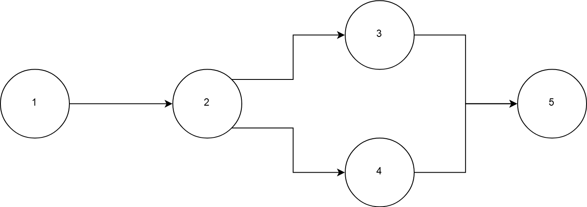
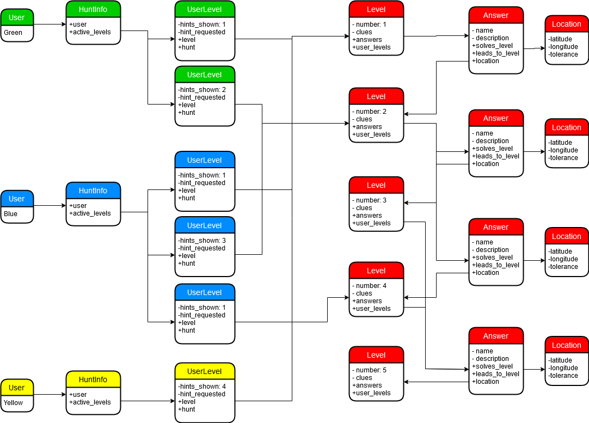

# Worked Example

We have created a simple hunt that looks as follows:

There are 5 levels:
* Level 1 leads to Level 2
* Level 2 leads to Levels 3 and 4
* Levels 3 and 4 lead to Level 5

There are 3 teams participating in this hunt:
* Green (Objects relevant to this user are displayed in Green)
* Blue (Objects relevant to this user are displayed in Blue)
* Yellow (Objects relevant to this user are displayed in Yellow)

The objects relevant to the Layout of the Hunt are displayed in Red.

## Layout

There are 5 Level objects, one for each of the Levels. Each Level is identified by the number (from 1 to 5).

There are 4 Answer objects. The 4 Answers are configured as follows:

|Answer | Solves | Leads-to |
|-------|--------|----------|
| 1 | Level 1 | Level 2 |
| 2 | Level 2 | Level 3 |
| 3 | Level 2 | Level 4 |
| 4 | Level 3, Level 4 | Level 5 |

Each Answer links to a Location via the location field.

## Progress

We can see from the UserLevels that exist, what Level's each user can access.

| User | Accessible Levels |
|------|-------------------|
| Green | Level 1, Level 2 |
| Blue | Level 1, Level 2, Level 4 |
| Yellow | Level 1 |

We can also see how different users can see a different number of hints on each Level.

| Level | to Green | to Blue | to Yellow |
|:-----:|:--------:|:-------:|:---------:|
| 1 | 1 | 1 | 4 |
| 2 | 2 | 3 | X |
| 3 | X | X | X |
| 4 | X | 1 | X |
| 5 | X | X | X |
